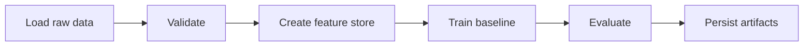

# feature-store-pipeline-metaflow

## Português

`feature-store-pipeline-metaflow` é um projeto de engenharia de ML com foco em construção de feature store tabular e orquestração de pipeline com `Metaflow`.

### Storytelling técnico: o que é Metaflow e por que ele importa

`Metaflow` é um framework de orquestração para ciência de dados e machine learning criado para organizar pipelines complexos em etapas explícitas, com artefatos versionáveis, reprodutibilidade e rastreabilidade de execução.

Na prática, ele ajuda a responder um problema muito comum em ML engineering: treinar um modelo é só uma parte pequena do trabalho. Antes do treino, existem ingestão, validação, criação de features, checkpoints intermediários e persistência de artefatos. Depois do treino, existem avaliação, comparação e operacionalização.

Sem uma estrutura de pipeline, esses passos costumam virar:

- notebooks desconectados;
- scripts com dependências implícitas;
- resultados difíceis de reproduzir;
- artefatos sem lineage clara.

`Metaflow` entra justamente para evitar isso. Ele permite definir um fluxo como uma sequência explícita de etapas com `FlowSpec` e `@step`, deixando claro:

- o que entra em cada etapa;
- quais artefatos são produzidos;
- como o estado caminha ao longo do pipeline;
- onde um fluxo pode evoluir para paralelismo, branching e produção.

### Por que este projeto foi desenhado com Metaflow

Em muitos projetos de ML, o problema central não é apenas treinar um modelo, mas organizar o fluxo de trabalho de forma reprodutível: ingestão, validação, criação de features, treino, avaliação e persistência de artefatos. `Metaflow` existe justamente para estruturar esse ciclo em etapas bem definidas, com passagem explícita de artefatos entre passos.

Neste projeto, o caso de uso escolhido foi risco de crédito tabular, porque ele ilustra bem a ideia de feature store:

- sinais brutos entram no pipeline;
- atributos derivados são construídos de forma determinística;
- o conjunto de features vira um artefato versionável;
- o modelo consome esse artefato para treino e avaliação.

### Objetivo técnico

- demonstrar `FlowSpec` e `@step`
- separar ingestão, validação, feature engineering, treino e persistência
- gerar snapshot de feature store
- treinar um baseline local reproduzível
- deixar a solução pronta para evoluções com branchs, agendamento e produção

### Topologia técnica

O projeto foi desenhado com duas camadas complementares:

- `flow.py`
  Implementa o fluxo principal em `Metaflow`, com steps encadeados e artefatos persistidos entre as etapas.
- `main.py`
  Implementa um runner local simplificado para validação rápida quando o ambiente ainda não possui `metaflow`.

Isso permite ao mesmo tempo:

- mostrar a arquitetura correta de orquestração;
- manter o projeto executável em ambiente de portfólio.

### Topologia do projeto

- [flow.py](flow.py)
  Pipeline principal em `Metaflow`
- [src/data_factory.py](src/data_factory.py)
  Geração do dataset sintético
- [src/feature_logic.py](src/feature_logic.py)
  Regras de feature engineering
- [main.py](main.py)
  Runner local simplificado para validação rápida
- [tests/test_pipeline.py](tests/test_pipeline.py)
  Testes do feature store e do pipeline local

### Pipeline



### Semântica das etapas

- `start`
  Carrega o dataset bruto.
- `validate`
  Verifica volume, taxa positiva e ausência de valores faltantes.
- `create_feature_store`
  Constrói a camada derivada de atributos.
- `train_model`
  Treina o baseline supervisionado sobre o snapshot de features.
- `evaluate`
  Calcula métricas de qualidade do modelo.
- `persist`
  Salva os artefatos do pipeline.
- `end`
  Finaliza o run com o resumo consolidado.

### Artefatos gerados

- `data/processed/feature_store_snapshot.csv`
- `data/processed/metaflow_report.json`
- `data/processed/local_pipeline_report.json`

Esses arquivos são gerados em runtime e não são versionados.

### Resultados atuais do runner local

- `row_count = 1600`
- `positive_rate = 0.2938`
- `feature_count = 17`
- `roc_auc = 0.8968`
- `average_precision = 0.7805`

### Contrato dos artefatos

O projeto produz três saídas principais:

- `feature_store_snapshot.csv`
  Snapshot tabular das features já derivadas.
- `metaflow_report.json`
  Resumo do fluxo em runtime quando executado via `Metaflow`.
- `local_pipeline_report.json`
  Resumo do runner local simplificado.

Esses artefatos permitem rastrear:

- volume processado;
- densidade da classe positiva;
- quantidade de features finais;
- qualidade preditiva do baseline.

### Execução

```bash
python3 main.py
python3 flow.py run
python3 -m unittest discover -s tests -v
python3 -m py_compile main.py flow.py src/data_factory.py src/feature_logic.py
```

### Observação de ambiente

O runner local em [main.py](main.py) foi incluído para garantir validação mesmo quando `metaflow` ainda não estiver instalado no ambiente. O fluxo principal continua sendo [flow.py](flow.py), mas a execução dele depende da presença da biblioteca `metaflow`.

## English

`feature-store-pipeline-metaflow` is an ML engineering project focused on tabular feature store construction and pipeline orchestration with `Metaflow`.

### Technical storytelling: what Metaflow is and why it matters

`Metaflow` is an orchestration framework for data science and machine learning pipelines. Its core value is not just scheduling code, but structuring ML work into explicit stages with reproducible artifacts and execution lineage.

In real ML systems, training is only one stage in a longer chain that usually includes:

- raw data ingestion
- validation
- feature engineering
- model training
- evaluation
- artifact persistence

Without pipeline orchestration, those steps often become disconnected notebooks or loosely coupled scripts. `Metaflow` helps turn them into a coherent execution graph through `FlowSpec` and `@step`.

### Why this project uses Metaflow

The project uses a tabular credit risk case to show how a feature store-oriented workflow can be expressed as a first-class ML pipeline, where derived features become explicit artifacts rather than hidden preprocessing side effects.

The local runner in [main.py](main.py) is included so the project remains executable even when `metaflow` is not yet installed in the environment. The primary orchestration entry point is still [flow.py](flow.py).

### Technical topology

- [flow.py](flow.py)
  Main orchestration entry point with `Metaflow`
- [main.py](main.py)
  Lightweight local validation runner
- [src/data_factory.py](src/data_factory.py)
  Synthetic dataset construction
- [src/feature_logic.py](src/feature_logic.py)
  Derived feature logic
- [tests/test_pipeline.py](tests/test_pipeline.py)
  Pipeline regression checks

### Current local runner results

- `row_count = 1600`
- `positive_rate = 0.2938`
- `feature_count = 17`
- `roc_auc = 0.8968`
- `average_precision = 0.7805`
