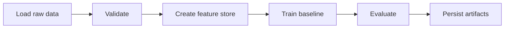

# feature-store-pipeline-metaflow

## Português

`feature-store-pipeline-metaflow` é um projeto de engenharia de ML com foco em construção de feature store tabular e orquestração de pipeline com `Metaflow`.

### Storytelling técnico: por que Metaflow

Em muitos projetos de ML, o problema central não é apenas treinar um modelo, mas organizar o fluxo de trabalho de forma reprodutível: ingestão, validação, criação de features, treino, avaliação e persistência de artefatos. `Metaflow` existe justamente para estruturar esse ciclo em etapas bem definidas, com passagem explícita de artefatos entre passos.

Neste projeto, o caso de uso escolhido foi risco de crédito tabular, porque ele ilustra bem a ideia de feature store:

- sinais brutos entram no pipeline;
- atributos derivados são construídos de forma determinística;
- o conjunto de features vira um artefato versionável;
- o modelo consome esse artefato para treino e avaliação.

### Objetivo técnico

- demonstrar `FlowSpec` e `@step`
- separar ingestão, validação, feature engineering, treino e persistência
- gerar snapshot de feature store
- treinar um baseline local reproduzível
- deixar a solução pronta para evoluções com branchs, agendamento e produção

### Topologia do projeto

- [flow.py](flow.py)
  Pipeline principal em `Metaflow`
- [src/data_factory.py](src/data_factory.py)
  Geração do dataset sintético
- [src/feature_logic.py](src/feature_logic.py)
  Regras de feature engineering
- [main.py](main.py)
  Runner local simplificado para validação rápida
- [tests/test_pipeline.py](tests/test_pipeline.py)
  Testes do feature store e do pipeline local

### Pipeline



### Artefatos gerados

- `data/processed/feature_store_snapshot.csv`
- `data/processed/metaflow_report.json`
- `data/processed/local_pipeline_report.json`

Esses arquivos são gerados em runtime e não são versionados.

### Execução

```bash
python3 main.py
python3 flow.py run
python3 -m unittest discover -s tests -v
python3 -m py_compile main.py flow.py src/data_factory.py src/feature_logic.py
```

### Observação de ambiente

O runner local em [main.py](main.py) foi incluído para garantir validação mesmo quando `metaflow` ainda não estiver instalado no ambiente. O fluxo principal continua sendo [flow.py](flow.py), mas a execução dele depende da presença da biblioteca `metaflow`.

## English

`feature-store-pipeline-metaflow` is an ML engineering project focused on tabular feature store construction and pipeline orchestration with `Metaflow`.

The local runner in [main.py](main.py) is included so the project remains executable even when `metaflow` is not yet installed in the environment. The primary orchestration entry point is still [flow.py](flow.py).
